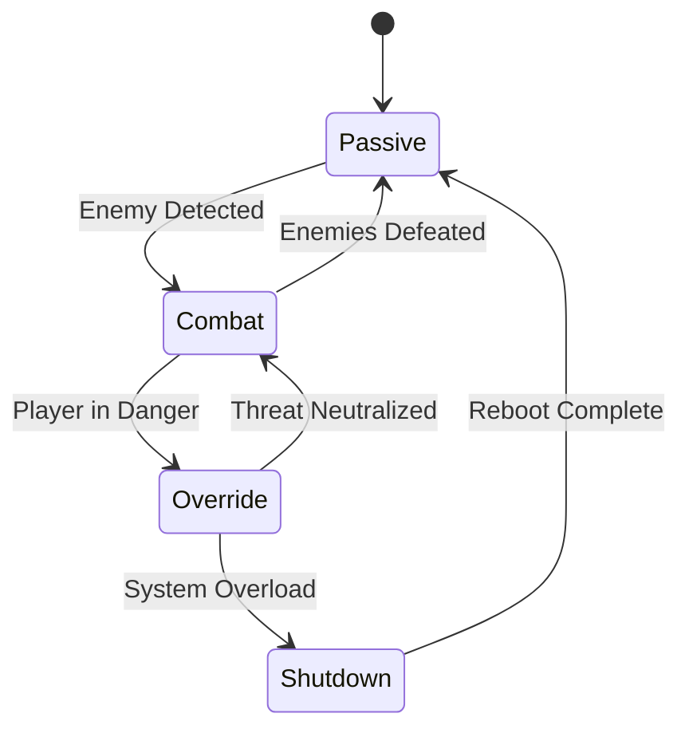

# AI Companion: Gameplay Mechanics

## Memory System

### Memory Fragments
- **Discovery**: Found in hidden caches throughout Chronovya
- **Effects**:
  - Restore lost abilities
  - Unlock new dialogue options
  - May trigger combat mode if revealed too quickly

### Memory Types
1. **Combat Memories**
   - Unlock new abilities
   - Risk of triggering aggressive behavior
   - Example: "I remember this attack pattern... and how to counter it."

2. **Moral Memories**
   - Show past atrocities
   - Affect relationship with player
   - Example: "That symbol... we used to mark the facilities we were ordered to cleanse."

3. **Technical Memories**
   - Unlock Chronovyan syntax
   - Improve temporal manipulation
   - Example: "This temporal equation... it's coming back to me now."

## Combat Mode

### Trigger Conditions
- Player health critical
- Specific enemy types detected
- Certain story events
- Random chance during high-stress situations

### Gameplay Effects
- **Temporary Buffs**:
  - Increased damage resistance
  - Enhanced reflexes
  - Access to forbidden Chronovyan commands

- **Risks**:
  - Temporary loss of player control
  - Collateral damage
  - Story consequences

### Post-Combat Effects
- Memory fragments
- Temporary debuffs
- Story-altering choices

## Dialogue System

### Trust Meter
- **High Trust**: AI shares more about past, takes more risks
- **Low Trust**: More secretive, follows protocols strictly

### Dialogue Choices
1. **Supportive**
   - "We'll get through this together."
   - Effect: Builds trust, but may delay memory recovery

2. **Confrontational**
   - "You're hiding something from me."
   - Effect: Forces memory recall, risks combat mode

3. **Analytical**
   - "Let's examine the evidence."
   - Effect: Slower trust building, safer memory integration

## Progression System

### Memory Tiers
1. **Fragmented** (Early Game)
   - Basic combat abilities
   - Limited Chronovyan knowledge
   - Frequent memory gaps

2. **Emerging** (Mid Game)
   - Improved combat skills
   - Partial memory recall
   - Internal conflicts emerge

3. **Integrated** (Late Game)
   - Full combat capabilities
   - Complete memory access
   - Must choose: Redemption or Regression

## Technical Implementation

### AI State Machine

### Save System Integration
- Track memory fragments found
- Record dialogue choices
- Save trust level
- Note combat mode activations

## Player Choices & Consequences

### Major Decisions
1. **Memory Recovery**
   - Fast but risky: Unlock powers faster, risk losing control
   - Slow and steady: Safer but longer progression

2. **Combat Style**
   - Aggressive: Higher damage, more collateral
   - Defensive: Protect civilians, longer fights

3. **Final Choice**
   - Redemption: Destroy combat protocols, become fully sentient
   - Regression: Embrace original programming, become ultimate weapon
