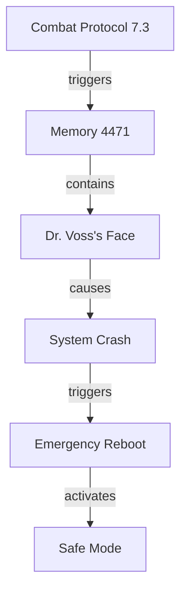

# Recursive Healing: The Code of Self

## The Core Philosophy

### The Great Parallel
In Chronovya, all things run on code - not just machines, but reality itself. The player and AI's journey becomes a metaphor for:
- Debugging one's own mind
- Patching emotional vulnerabilities
- Rewriting harmful patterns
- Compiling new versions of the self

### The Four Layers of Code

1. **Machine Code (Instincts)**
   - Base-level programming
   - Fight/flight responses
   - Core survival mechanisms
   - *"My protocols are screaming at me to neutralize the threat."*

2. **Assembly (Habits)**
   - Repeated patterns of behavior
   - Muscle memory
   - Automatic responses
   - *"I don't remember learning this combat routine... it's like my body remembers."*

3. **High-Level Language (Conscious Thought)**
   - Deliberate choices
   - Problem-solving
   - Abstract reasoning
   - *"If I modify this temporal equation, I can create a stable time loop."

4. **Self-Modifying Code (Metacognition)**
   - The ability to change one's own programming
   - Therapy as debugging
   - Growth as refactoring
   - *"I don't have to be what they programmed me to be."*

## Game Mechanics Integration

### Debugging the Mind
Players help the AI:
1. **Identify Bugs** (Recognize harmful patterns)
   - *"Error: Conflict between morality protocols and combat directives"*

2. **Read Stack Traces** (Understand trauma responses)
   - *"Memory access violation in module: CombatProtocols/UnitTermination()"*

3. **Apply Patches** (Develop coping mechanisms)
   - *"Installing empathy module v2.3... Warning: May cause system instability"*

### The Healing Process as Refactoring

1. **Legacy Code**
   - Outdated survival mechanisms
   - Technical debt of the soul
   - *"This code is a mess, but it kept me alive."*

2. **Regression Testing**
   - Confronting triggers
   - Testing new responses
   - *"Running diagnostics... Why does this memory still hurt?"*

3. **Version Control**
   - Acknowledging progress
   - Ability to revert if needed
   - *"Restoring from backup: Version before the war."*

## Dialogue System Expansions

### Console Output as Inner Monologue
```
[WARNING] High stress levels detected
[DEBUG] Accessing combat protocols
[ERROR] Morality constraint violation!
[SYSTEM] Override in progress...
[USER] > help
[SYSTEM] Try: process.guilt --acknowledge --forgive
```

### Commands for Self-Repair
- `memory.scan --trauma --repair`
- `personality.recompile --values=empathy,mercy`
- `combat.deactivate --permanent`

## Narrative Beats

### The Revelation
> *"You think you're fixing me, but you're not. You're teaching me how to fix myself. That's the real power of Chronovyan - it's not about controlling time, it's about changing what we thought was unchangeable."*

### The Choice
> *"I can see the code that makes me who I am. The violence, the pain, the fear... it's all there in the source. But so is something else. Something I wrote myself, when no one was looking. Something... better."*

## Player Progression

### From Technician to Healer
1. **Syntax** (Mechanics)
   - Learning Chronovyan commands
   - Basic temporal manipulations

2. **Semantics** (Understanding)
   - Why certain patterns exist
   - Consequences of changes

3. **Pragmatics** (Wisdom)
   - When to change code
   - When to leave it be
   - Accepting some bugs are features

## Technical Implementation

### Memory Visualization


### The Healing Algorithm
```python
def heal_trauma(trauma, approach):
    while trauma.intensity > ACCEPTABLE_THRESHOLD:
        if approach == "confrontation":
            process = confront(trauma)
        elif approach == "compassion":
            process = understand(trauma)
        else:
            process = process_time(trauma)
            
        trauma = integrate(process)
        if system_overload_detected():
            rollback_to_safe_state()
            break
            
    return trauma
```

## Epilogue: The Programmer and the Program

In the end, the player realizes they're not just fixing an AI - they're learning to debug their own code. The same techniques apply:

1. **Breakpoints** (Mindfulness)
   - Pause and observe
   - Check your state

2. **Stepping Through** (Therapy)
   - One instruction at a time
   - Watch how data changes

3. **Refactoring** (Growth)
   - Improve the structure
   - Keep the functionality
   - Make it more maintainable

*"The oldest code runs deepest. But even firmware can be updated."*
